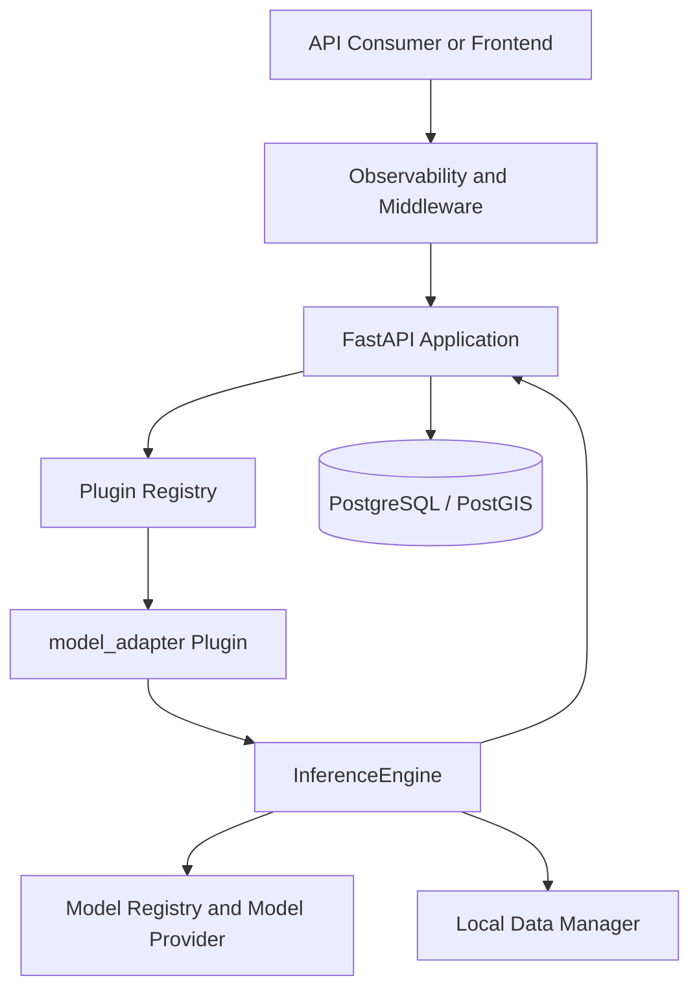

# GeoAI Platform

GeoAI Platform is a modular foundation for building geospatial analysis and GeoAI workflows without tying the whole system to one model, one dataset, or one research use case.

The project started from a practical question: how can geospatial data workflows, model execution, result tracking, and future visualisation be organised in a way that remains understandable as the system grows?

Rather than building a single landslide-model application, the focus here is on the platform around future models: API boundaries, plugin execution, model contracts, storage, traceability, and reproducible local workflows.

At its current stage, the repository includes a working backend, a PostGIS-backed persistence layer, a plugin system, a model inference pipeline, a reproducible demo, and an early React frontend workspace.

---

## Why this project exists

Many GeoAI projects begin as notebooks, trained model files, or one-off analysis scripts. That is useful for research, but it becomes harder to manage when more datasets, models, users, or workflows are introduced.

This project explores a more structured direction:

- Keep platform infrastructure separate from domain-specific GeoAI workflows.
- Allow new capabilities to be added through plugins.
- Treat trained models as versioned and traceable components rather than isolated weight files.
- Keep inference requests and outputs explicit enough to be inspected, tested, and extended.
- Preserve a clear path from local experimentation to a more complete application later.

The repository is not presented as a finished commercial product. It is a portfolio and engineering project that demonstrates how a maintainable GeoAI system can be structured.

---

## What currently works

The current implementation includes:

- A FastAPI backend with health, plugin, generic execution, inference, dataset, run, and result endpoints.
- A Docker-based local development stack with PostgreSQL/PostGIS.
- Database migrations through Alembic.
- Plugin discovery and registration at application startup.
- Generic plugin execution with timeout and centralised error handling.
- A `model_adapter` plugin that connects runtime-loadable model classes to the inference pipeline.
- A model registry and version-resolution workflow.
- A structured inference lifecycle with validation, input loading, model loading, prediction, timing, and trace events.
- Local JSON input loading through an abstracted data manager.
- Dataset, run, and result persistence through SQLAlchemy repositories and a Unit of Work pattern.
- Middleware-based request logging, error handling, and basic request metrics.
- A reproducible end-to-end demo using a synthetic payload and a lightweight `DummyModel`.
- An early React and TypeScript frontend workspace with a map-oriented interface foundation.
- Automated checks through GitHub Actions for formatting, linting, and tests.

---

## What this project does not claim yet

The current repository does not include:

- A trained landslide-detection model.
- Real Sentinel-2, GeoTIFF, COG, or large-raster inference.
- Cloud object storage such as S3 or MinIO.
- Distributed or queue-based execution for long-running jobs.
- User authentication or multi-tenant access control.
- A complete production deployment of the frontend.
- A finished LLM-based reasoning feature.
- A real geospatial benchmark or scientific validation dataset.

The included `DummyModel` is intentionally simple. It validates the platform path, not model accuracy.

---

## Architecture at a glance



The main design idea is that the API does not need to know the implementation details of every future model.

A request enters the API, the appropriate plugin is resolved through the registry, and the plugin delegates model execution to the inference engine. This keeps the platform layer stable while allowing new model adapters and domain workflows to be added later.

---

## Inference flow

The current inference path is:

```text
Client request
→ FastAPI endpoint
→ PluginExecutor
→ model_adapter
→ InferenceEngine
→ validate request
→ resolve model version
→ load model
→ load input
→ predict
→ return structured JSON response
```

The response can include:

- Model name and resolved version
- Request and trace identifiers
- Prediction output
- Stage-level timing information
- Execution events
- Request tags

This structure is intended to make future model runs easier to inspect and debug.

---

## Reproducible demo

The repository includes a small end-to-end demo that verifies the real platform path without requiring a GPU, external data services, or a trained model artifact.

The demo:

1. Checks that the backend is healthy.
2. Confirms that `model_adapter` was discovered.
3. Sends the version-controlled request from:

```text
demo/sample_inference_request.json
```

4. Runs inference through the public API.
5. Prints the resolved model version, trace ID, output shape, timings, and execution stages.

The demo uses:

```text
DummyModel
```

with a synthetic three-band raster-like payload. It is not a satellite scene, training dataset, or landslide benchmark.

### Run the demo

Create your local environment file first:

```bash
cp .env.example .env
```

Then fill in the required values in `.env`:

```text
POSTGRES_USER
POSTGRES_PASSWORD
```

Start the local development stack:

```bash
docker compose --profile dev up -d --build
```

Run the demo:

```bash
python scripts/run_demo.py
```

On Windows PowerShell:

```powershell
Copy-Item .env.example .env
```

After filling in the required values in `.env`:

```powershell
docker compose --profile dev up -d --build
python scripts/run_demo.py
```

A successful run confirms this path:

```text
API
→ Plugin Registry
→ model_adapter
→ InferenceEngine
→ JSON response
```

More detail is available in:

- [Demo input package](demo/README.md)
- [End-to-end demo pipeline](docs/demo-pipeline.md)

---

## Quick start

### Prerequisites

- Docker Desktop with Docker Compose
- Python 3.11 or later for local helper scripts and tests
- Node.js and npm only if you want to run the frontend workspace

### Start the backend stack

```bash
docker compose --profile dev up -d --build
```

Check the running services:

```bash
docker compose ps
```

Check API health:

```bash
curl http://localhost:8000/health
```

Expected response:

```json
{
  "status": "ok",
  "core_loaded": true
}
```

On Windows PowerShell:

```powershell
Invoke-RestMethod http://localhost:8000/health
```

### Stop the backend stack

```bash
docker compose --profile dev down
```

To remove the local database volume as well:

```bash
docker compose --profile dev down -v
```

---

## API surface

The main endpoints are:

| Endpoint | Purpose |
|---|---|
| `GET /health` | Confirms that the backend is running and the core container is available. |
| `GET /plugins` | Lists plugins discovered by the platform. |
| `POST /run/{plugin_name}` | Runs a plugin through the shared execution layer. |
| `POST /inference` | Runs the unified inference workflow through `model_adapter`. |
| `GET /datasets` | Lists stored datasets. |
| `POST /datasets` | Creates a dataset record. |
| `GET /datasets/{dataset_id}` | Retrieves a dataset record. |
| `POST /runs` | Registers a run linked to a dataset. |
| `GET /runs/{run_id}` | Retrieves a run record. |
| `POST /results` | Stores a result linked to a run. |
| `GET /results/{result_id}` | Retrieves a stored result. |
| `GET /datasets/{dataset_id}/runs` | Lists runs associated with a dataset. |
| `GET /runs/{run_id}/results` | Lists results associated with a run. |

Interactive API documentation is available locally after startup:

```text
http://localhost:8000/docs
```

---

## Frontend workspace

The repository includes an early frontend workspace built with:

```text
React
TypeScript
Vite
Leaflet
React Leaflet
```

It provides the foundation for:

- Listing available plugins.
- Loading datasets from the backend.
- Selecting a plugin and dataset.
- Displaying loading and error states.
- Triggering execution requests.
- Previewing returned results.
- Showing a basic map-oriented interface.

The frontend is still an MVP workspace rather than a complete production interface. Its purpose is to show how backend execution and human-facing geospatial interpretation can begin to connect.

To run it locally:

```bash
cd frontend
npm install
npm run dev
```

The default backend URL is:

```text
http://localhost:8000
```

It can be changed through:

```text
frontend/.env.example
```

---

## Project structure

```text
backend/
  api/                 FastAPI routes and request schemas
  db/                  SQLAlchemy models, repositories, migrations, Unit of Work
  ingestion/           Local ingestion and validation utilities
  services/            Backend service-level abstractions

core/
  config/              Settings and validation
  data_manager/        Input data access abstractions
  inference/           Request, execution, providers, and response lifecycle
  models/              Model contracts, metadata, artifacts, and registry
  plugins/             Plugin interface, discovery, registry, and executor
  evaluation/          Basic metrics and run comparison utilities
  middleware.py        Request metrics and error handling

plugins/
  model_adapter/       Adapter between runtime model classes and InferenceEngine

demo/
  sample_inference_request.json
  README.md

docs/
  architecture.md
  plugin-flow.md
  inference-lifecycle.md
  demo-pipeline.md

frontend/
  React and TypeScript application workspace

scripts/
  run_demo.py
  smoke_test.py
  smoke_plugin_inference.py
  smoke_unified_inference.py
  run_dev.py
  deploy.sh

tests/
  Automated tests for model contracts, registry, inference, plugins, and persistence
```

---

## Testing and verification

The repository includes tests around model contracts, inference execution, plugin integration, registry behaviour, lifecycle handling, metrics, and persistence.

Run the test suite from the repository root:

```bash
pytest
```

Useful local checks are also available through:

```bash
python scripts/smoke_test.py
python scripts/smoke_plugin_inference.py
python scripts/smoke_unified_inference.py
python scripts/run_demo.py
```

On systems where `make` is available:

```bash
make up
make smoke
make demo
make down
```

For Windows PowerShell, the direct `docker compose` and `python` commands are usually more convenient.

---

## Documentation

More detailed design notes are available in:

- [Architecture overview](docs/architecture.md)
- [Plugin execution flow](docs/plugin-flow.md)
- [Inference lifecycle](docs/inference-lifecycle.md)
- [End-to-end demo pipeline](docs/demo-pipeline.md)
- [Demo input package](demo/README.md)
- [Project vision](docs/vision.md)

---

## Future direction

The next major step is to connect the platform to a real GeoAI research workflow.

A likely first use case is a landslide-detection model trained on Sentinel-based imagery for the Padena area in Isfahan, Iran. The model itself can be trained and evaluated separately in Kaggle, a cloud GPU environment, or research infrastructure.

Once a model is ready, the platform is designed to support an integration path like this:

```text
Trained model artifact
→ model metadata and version
→ model adapter
→ Model Registry
→ InferenceEngine
→ persisted result
→ frontend visualisation
```

That future work will require additional components, including:

- Raster and GeoTIFF input support.
- Consistent preprocessing between training and inference.
- Band-order and normalisation contracts.
- Tiling for large satellite scenes.
- Probability-mask postprocessing.
- Vectorisation and geospatial result storage.
- Map-based result exploration.

The current project does not attempt to solve all of that yet. It establishes the structure that should make those next steps more deliberate and less invasive.

---

## Project status

This repository represents an actively developed portfolio project.

The core architecture, local Docker workflow, plugin execution model, model lifecycle foundation, persistence layer, reproducible demo, and frontend MVP have been implemented.

The next stage is not to rebuild the platform from scratch, but to progressively connect it to real geospatial data, trained models, richer visualisation, and more production-oriented operational workflows.