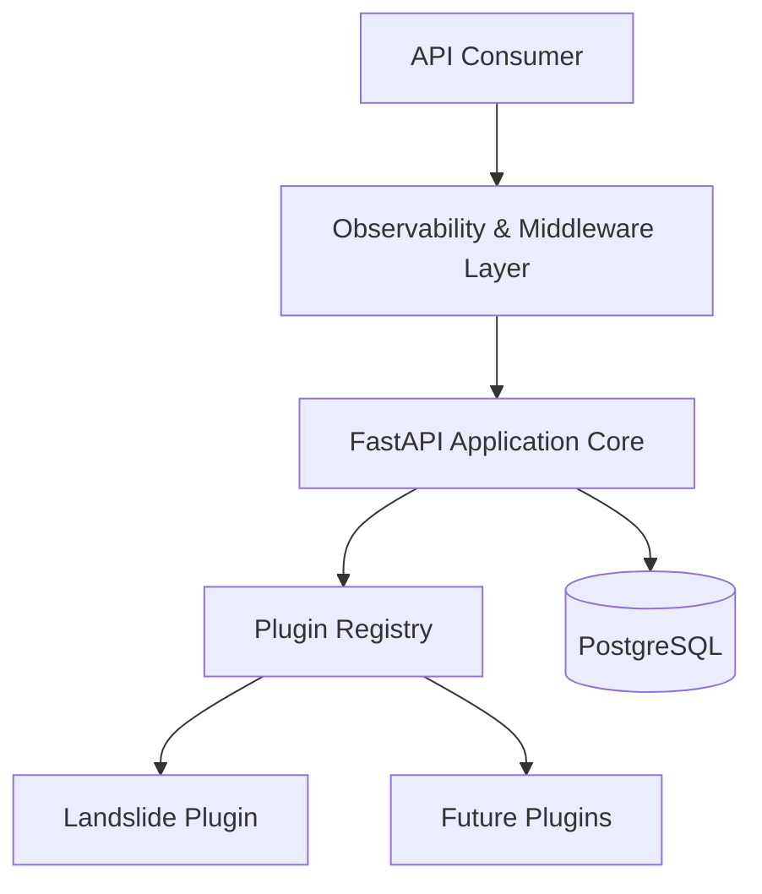

# Architecture Overview

## Why this project exists

This project started as a personal effort to build a reusable GeoAI platform rather than another single-purpose machine learning repository.

Many geospatial AI projects are tightly coupled to one dataset, one model, or one research workflow. The goal here was different: create a modular backend architecture capable of hosting multiple geospatial AI capabilities through a plugin-based design.

The current implementation focuses on platform foundations. Model training workflows and large-scale inference pipelines are intentionally treated as future extensions rather than core architectural dependencies.

---

## Architectural Philosophy

The platform follows a simple principle:

> Keep the platform independent from the models.

Instead of embedding domain-specific logic directly into the application core, geospatial capabilities are exposed through plugins. This allows the backend to evolve without becoming tightly coupled to a specific AI workflow.

As a result, the platform can support future landslide detection, flood mapping, wildfire monitoring, or other geospatial analysis modules with minimal changes to the core system.

---

## System Overview

---

## Main Components

### API Layer

The API layer exposes platform functionality through FastAPI endpoints. It acts as the entry point for external clients and future frontend applications.

### Observability Layer

Request logging, error handling, and execution monitoring are implemented at the middleware level. The objective is to keep operational concerns separate from business logic.

### Core Layer

The core layer contains application startup logic, service orchestration, plugin management, and shared platform functionality.

### Plugin Layer

Plugins provide domain-specific functionality.

At the current stage, the platform contains a landslide detection plugin that serves as a reference implementation for future geospatial AI extensions.

### Persistence Layer

PostgreSQL is used to store application data and execution-related information while keeping the architecture ready for future metadata and model management capabilities.

---

## Current Scope

The current repository focuses on platform engineering rather than model development.

The objective was to establish a maintainable backend foundation that can later host multiple machine learning and deep learning workflows without requiring architectural redesign.

Future work will focus on integrating trained segmentation and geospatial AI models into the platform through the existing plugin infrastructure.
