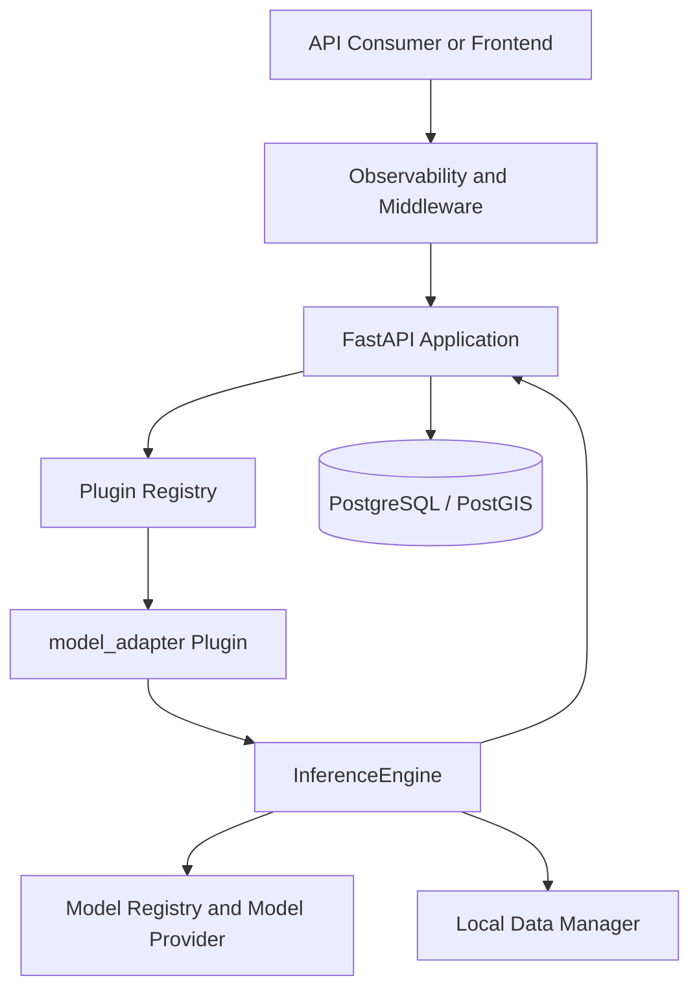

# Architecture Overview

## Why this project exists

GeoAI Platform began as an attempt to build a reusable technical foundation for geospatial analysis and future GeoAI workflows.

Many GeoAI projects start with a notebook, a trained model, or a single research workflow. That is often the right place to begin, but it can become difficult to maintain once more datasets, models, users, or analysis paths are added.

The goal of this project is different. It focuses on the platform around future models: API boundaries, plugin execution, model contracts, inference orchestration, persistence, observability, and reproducible local development.

The repository is not intended to represent a finished production product. It is a portfolio and engineering project that explores how a GeoAI system can remain understandable and extendable as it grows.

---

## Architectural principle

The central idea behind the platform is simple:

> Keep the platform independent from individual models and domain workflows.

The API and core infrastructure should not need to change whenever a new GeoAI capability is introduced.

Instead, domain-specific behaviour is added through plugins. This keeps stable platform responsibilities, such as request handling, execution control, model lifecycle, persistence, and logging, separate from changing analytical workflows.

That separation makes it possible to add future capabilities such as landslide detection, flood mapping, wildfire analysis, or other geospatial workflows without redesigning the entire application.

---

## System overview


```mermaid
flowchart TD
    Client[API Consumer or Frontend]
    Middleware[Observability and Middleware]
    API[FastAPI Application]
    Registry[Plugin Registry]
    Adapter[model_adapter Plugin]
    Engine[InferenceEngine]
    Models[Model Registry and Model Provider]
    Storage[(PostgreSQL / PostGIS)]
    Data[Local Data Manager]

    Client --> Middleware
    Middleware --> API

    API --> Registry
    API --> Storage

    Registry --> Adapter
    Adapter --> Engine

    Engine --> Models
    Engine --> Data

    Engine --> API
```

A request enters through the FastAPI application. The API resolves the appropriate plugin through the plugin registry instead of directly embedding domain-specific execution logic in the endpoint layer.

The currently active inference plugin is:

```text
model_adapter
```

It acts as the bridge between the plugin system and the shared inference engine.

---

## Main components

### API layer

The backend is built with FastAPI.

It provides the public application boundary for health checks, plugin discovery, generic plugin execution, inference requests, and persistence-related resources such as datasets, runs, and results.

The API layer is intentionally kept focused on HTTP concerns. It receives requests, validates schemas, delegates work to the appropriate service or execution layer, and returns structured responses.

It should not contain model-specific or workflow-specific logic.

---

### Middleware and observability

Middleware handles cross-cutting concerns that should not be repeated inside every endpoint or plugin.

The current implementation includes request logging, error handling, timing, and basic request metrics.

This helps make failures and execution behaviour easier to inspect without mixing operational concerns into business logic.

---

### Service container

The application uses a central service container to create and expose shared services during startup.

This avoids scattering dependency construction across routes, plugins, and internal modules.

The container provides a controlled place for shared infrastructure such as configuration, registries, data access, persistence services, and execution-related dependencies.

---

### Plugin layer

Plugins represent domain-facing capabilities that can evolve independently from the platform core.

A plugin follows a shared contract and is discovered and registered during application startup.

The plugin registry keeps track of available plugins, while the plugin executor handles common execution concerns such as resolving the requested plugin, creating an instance, applying timeout handling, and returning controlled errors.

This means that future workflows do not need their own separate execution framework or tightly coupled API endpoint.

---

### `model_adapter` plugin

The current inference workflow is exposed through the `model_adapter` plugin.

Its role is not to contain a specific trained model. Instead, it connects a runtime-loadable model class to the shared inference infrastructure.

The adapter receives the model-related request, prepares the model provider, and delegates the actual lifecycle to the inference engine.

This keeps model-specific implementations separate from the API and makes it possible to add future model classes without changing the core request path.

The repository currently includes a lightweight:

```text
DummyModel
```

This model is intentionally simple. It exists to validate the complete platform path and does not represent a trained scientific model or a real landslide-detection workflow.

---

### Inference engine

The `InferenceEngine` is responsible for the common model-execution lifecycle.

Its current flow includes:

```text
validate request
→ resolve model version
→ load model
→ load input
→ run prediction
→ collect execution events and timings
→ return a structured response
```

By keeping this lifecycle centralised, the platform can apply the same general execution pattern to future models instead of reimplementing validation, loading, timing, and response handling for every new workflow.

The inference response can include model information, resolved version, request and trace identifiers, prediction output, stage timings, execution events, and request tags.

---

### Model layer

The model layer provides shared contracts and metadata structures for model registration and execution.

It separates the idea of a model from the details of a particular framework or artifact format.

This is important for future integration because a trained model should be treated as a versioned component with explicit metadata, input expectations, artifacts, and lifecycle behaviour, rather than as an isolated weights file.

The current model registry and version-resolution flow establish that foundation.

---

### Data manager

The data manager abstracts input access away from individual model implementations.

The current implementation supports local JSON-based input loading for the reproducible demo workflow.

This keeps the model lifecycle separate from the physical location of input data.

In the future, the same abstraction can be extended to support raster files, GeoTIFFs, Cloud Optimized GeoTIFFs, object storage, or external geospatial services without forcing model code to depend directly on a particular storage system.

---

### Persistence layer

PostgreSQL and PostGIS provide the local persistence foundation.

The current data model supports traceable relationships between:

```text
Dataset
→ Run
→ Result
→ optional Feedback
```

SQLAlchemy repositories and a Unit of Work pattern keep persistence concerns separate from endpoint logic and domain workflows.

This structure is useful for future GeoAI workflows because it allows inputs, execution records, outputs, and user feedback to be tracked as related entities rather than disconnected files or responses.

---

### Frontend workspace

The repository also contains an early React and TypeScript frontend workspace.

Its role is to begin connecting backend execution with human-facing interaction and geospatial interpretation.

The frontend currently provides a foundation for plugin discovery, dataset selection, execution handling, loading and error states, result preview, and a map-oriented interface.

It is still an MVP workspace rather than a finished production frontend.

---

## Current inference path

The active end-to-end inference path is:

```text
Client request
→ FastAPI endpoint
→ PluginExecutor
→ model_adapter
→ InferenceEngine
→ validation
→ version resolution
→ model loading
→ input loading
→ prediction
→ structured JSON response
```

The reproducible demo exercises this real path through the public API.

It confirms that the backend is healthy, verifies that the required plugin was discovered, sends a version-controlled sample request, and prints the resulting execution trace.

More detail is available in:

- [Plugin execution flow](plugin-flow.md)
- [Inference lifecycle](inference-lifecycle.md)
- [End-to-end demo pipeline](demo-pipeline.md)

---

## Current scope

The repository currently focuses on platform engineering rather than model development.

It includes the architectural foundation required for future GeoAI workflows, but it does not yet include a trained landslide model, real Sentinel imagery, GeoTIFF-based inference, cloud object storage, distributed job execution, or a full production deployment.

The current priority is to keep the platform boundaries clear and the local workflow reproducible before connecting it to more complex scientific models and geospatial data pipelines.

---

## Future integration direction

A likely first research-oriented use case is a landslide-detection model trained on Sentinel-based imagery for the Padena area in Isfahan, Iran.

That model can be trained and evaluated separately in Kaggle, a cloud GPU environment, or research infrastructure.

Once it is ready, the intended integration path is:

```text
Trained model artifact
→ model metadata and version
→ model adapter
→ Model Registry
→ InferenceEngine
→ persisted result
→ frontend visualisation
```

A complete integration will require additional work, including:

- Raster and GeoTIFF input support.
- Stable band-order and normalisation contracts.
- Consistent preprocessing between training and inference.
- Tiling for large satellite scenes.
- Probability-mask postprocessing.
- Vectorisation and geospatial result storage.
- Map-based result exploration.

The current architecture does not claim to solve those future problems yet. Its purpose is to provide a structure in which they can be added deliberately, without forcing a major rewrite of the platform core.