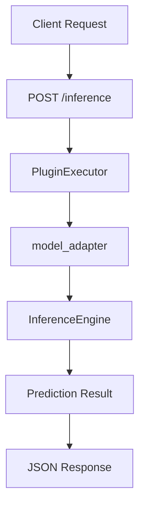

# End-to-End Demo Pipeline

## Purpose

The goal of this demo is not to showcase a specific machine learning model.

Instead, it demonstrates how a request travels through the GeoAI Platform and how the different architectural components interact during execution.

This provides a lightweight and reproducible way to validate the platform without requiring GPU resources, external data providers, or large model artifacts.

---

## Demo Scenario

A client submits an inference request through the public API.

The request is routed through the platform's execution infrastructure and eventually returns a prediction response.

The objective is to demonstrate:

* API request handling
* Request validation
* Plugin discovery and execution
* Inference orchestration
* Response generation

---

## Workflow Overview



---

## Input

The demo uses a lightweight sample payload.

Example:

```json
{
  "model_name": "demo-model",
  "input_data": {
    "source": "sample_dataset"
  }
}
```

The payload is intentionally simple because the focus of this demonstration is the execution pipeline rather than model accuracy.

---

## Execution Stages

### 1. API Layer

The client sends an inference request to the platform.

The request enters the FastAPI application and passes through the middleware layer.

### 2. Validation Layer

The payload is validated using the platform's request schemas before any execution begins.

### 3. Plugin Execution

The request is delegated to the PluginExecutor.

The executor locates and invokes the appropriate plugin.

### 4. Inference Orchestration

The model_adapter plugin forwards the request to the InferenceEngine.

This layer provides a stable interface between API consumers and future machine learning models.

### 5. Response Generation

The inference result is returned through the execution stack and delivered back to the client as a JSON response.

---

## Example Response

```json
{
  "status": "success",
  "model": "demo-model",
  "prediction": "demo_result"
}
```

---

## Why This Demo Matters

The purpose of this workflow is to validate the platform architecture independently from model training.

Machine learning models can later be trained in dedicated environments such as Kaggle, cloud GPUs, or research clusters and integrated through the existing plugin and inference infrastructure.

Because of this separation, the platform can evolve independently from any individual model implementation.
