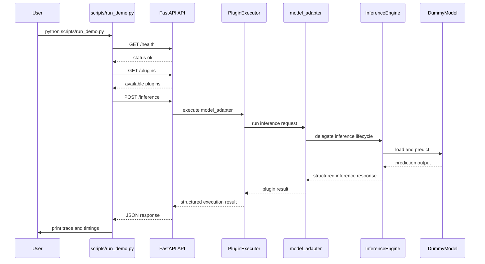

# End-to-End Demo Pipeline

## Purpose

This document explains the reproducible demo workflow included in GeoAI Platform.

The demo is intentionally small. It does not try to prove scientific model quality, and it does not use real Sentinel imagery or a trained landslide model.

Its purpose is different:

> Verify that the platform path works end to end through the public API.

The demo checks that the backend is running, confirms that the required plugin was discovered, sends a version-controlled inference request, runs it through the real inference endpoint, and prints the resulting trace information.

This makes the project easier to verify from a clean local setup.

---

## What the demo validates

The current demo validates this execution path:

```text
API
→ Plugin Registry
→ model_adapter
→ InferenceEngine
→ JSON response
```

This is the same architectural path that future trained models are expected to use.

The current model is only a lightweight `DummyModel`, but the surrounding platform flow is real.

That distinction is important:

```text
The demo validates platform execution.
It does not validate landslide-detection accuracy.
```

---

## Files involved

The demo is mainly based on two files:

```text
demo/sample_inference_request.json
scripts/run_demo.py
```

The sample request contains a small synthetic raster-like payload.

The demo runner sends that request to the backend and checks the response.

Related documentation is available in:

```text
README.md
demo/README.md
docs/plugin-flow.md
docs/inference-lifecycle.md
```

---

## Demo input

The demo request is stored in:

```text
demo/sample_inference_request.json
```

It uses a synthetic three-band raster-like input.

At a high level, the request includes:

```text
model_class
timeout_seconds
model name
version strategy
input payload
spatial metadata
request tags
```

The input payload is deliberately small so that the demo can run quickly on a normal local machine.

It is not a real satellite image. It is not a GeoTIFF. It is not a landslide dataset.

The goal is to keep the demo focused on the platform workflow rather than on data volume, GPU availability, or model accuracy.

---

## Demo model

The demo uses:

```text
DummyModel
```

`DummyModel` is a small model implementation used to confirm that the inference lifecycle can load a model, receive input, run prediction, and return a structured response.

It should not be interpreted as a real GeoAI model.

In a future landslide-detection workflow, a trained model such as a U-Net or DeepLab-based segmentation model would replace this lightweight demo model.

The surrounding platform path should remain similar:

```text
model_adapter
→ InferenceEngine
→ Model Registry
→ Model Provider
→ structured response
```

---

## How the demo runs

The demo runner performs the following steps:

```text
1. Check the backend health endpoint.
2. Verify that the core application container is loaded.
3. Fetch the available plugins.
4. Confirm that model_adapter is available.
5. Load demo/sample_inference_request.json.
6. Send the request to POST /inference.
7. Validate that the response status is successful.
8. Print model, version, trace ID, output shape, timings, and execution stages.
```

This gives a quick and inspectable way to confirm that the main backend workflow is working.

---

## Request flow

The request flow looks like this:


```mermaid
sequenceDiagram
    participant User
    participant Script as scripts/run_demo.py
    participant API as FastAPI API
    participant Executor as PluginExecutor
    participant Adapter as model_adapter
    participant Engine as InferenceEngine
    participant Model as DummyModel

    User->>Script: python scripts/run_demo.py
    Script->>API: GET /health
    API-->>Script: status ok

    Script->>API: GET /plugins
    API-->>Script: available plugins

    Script->>API: POST /inference
    API->>Executor: execute model_adapter
    Executor->>Adapter: run inference request
    Adapter->>Engine: delegate inference lifecycle
    Engine->>Model: load and predict
    Model-->>Engine: prediction output
    Engine-->>Adapter: structured inference response
    Adapter-->>Executor: plugin result
    Executor-->>API: structured execution result
    API-->>Script: JSON response

    Script->>User: print trace and timings
```

---

## Run the demo

Create a local environment file first:

```bash
cp .env.example .env
```

Then fill in the required values in `.env`:

```text
POSTGRES_USER
POSTGRES_PASSWORD
```

Start the local development stack:

```bash
docker compose --profile dev up -d --build
```

Run the demo:

```bash
python scripts/run_demo.py
```

On Windows PowerShell:

```powershell
Copy-Item .env.example .env
```

After filling in the required values in `.env`, run:

```powershell
docker compose --profile dev up -d --build
python scripts/run_demo.py
```

---

## Expected output

The exact trace ID and timing values will change from run to run.

A successful run should look conceptually like this:

```text
Starting GeoAI Platform reproducible demo...

GeoAI Platform demo completed successfully.

API endpoint: http://localhost:8000/inference
Plugin: model_adapter
Model: dummy_model
Resolved version: 1.0.0
Trace ID: <generated-trace-id>
Prediction shape: 1 x 4 x 4
Total inference time: <value> ms

Execution stages:
- validate: OK
- resolve_version: OK
- load_model: OK
- load_input: OK
- predict: OK

The demo validated the path:
API -> Plugin Registry -> model_adapter -> InferenceEngine -> JSON response
```

The important part is not the exact timing.

The important part is that all expected stages complete successfully and the response follows the platform inference structure.

---

## What happens inside `/inference`

The public inference endpoint receives the request and routes it through the plugin execution layer.

The active plugin for this path is:

```text
model_adapter
```

The adapter connects the request to the shared:

```text
InferenceEngine
```

The engine then performs the common lifecycle:

```text
validate request
→ resolve model version
→ load model
→ load input
→ run prediction
→ collect timings and events
→ return structured response
```

This is described in more detail in:

```text
docs/inference-lifecycle.md
```

---

## Why the demo uses a synthetic payload

The demo intentionally avoids real satellite data.

That keeps the workflow easy to run and easy to verify.

A real GeoAI model would require additional components such as:

```text
Raster input handling
GeoTIFF or COG support
Band-order contracts
Normalisation rules
Tiling for large scenes
Model artifacts
Post-processing
Vectorisation
Map visualisation
```

Those are future integration tasks.

The demo keeps the current responsibility narrow:

```text
Can the platform execute an inference request through the intended architecture?
```

At the current stage, the answer should be yes.

---

## Relationship to future landslide detection

A future Padena landslide-detection model would not change the basic idea of this demo path.

The future workflow would likely be:

```text
trained model artifact
→ model metadata and version
→ model adapter
→ Model Registry
→ InferenceEngine
→ persisted result
→ frontend visualisation
```

The main difference would be the model package and data pipeline.

Instead of `DummyModel` and a small JSON payload, the future workflow would need a trained model, real raster input, preprocessing, post-processing, and geospatial result storage.

The platform is being prepared so that this future integration can happen through clear contracts rather than by rewriting the whole backend.

---

## Troubleshooting

### Backend is not reachable

Check whether the containers are running:

```bash
docker compose ps
```

If needed, rebuild and start again:

```bash
docker compose --profile dev up -d --build
```

---

### Environment variables are missing

Make sure `.env` exists:

```bash
ls .env
```

On Windows PowerShell:

```powershell
Test-Path .env
```

If it does not exist, create it from the example file:

```bash
cp .env.example .env
```

or on Windows PowerShell:

```powershell
Copy-Item .env.example .env
```

Then provide the required database values.

---

### `model_adapter` is not listed

Check the plugin list directly:

```bash
curl http://localhost:8000/plugins
```

On Windows PowerShell:

```powershell
Invoke-RestMethod http://localhost:8000/plugins
```

If `model_adapter` is missing, restart the backend container and check the backend logs.

---

### Demo request fails

Run:

```bash
python scripts/run_demo.py
```

and inspect the stage where the failure occurs.

The printed stage information is useful because different failures point to different layers:

```text
health failure
→ backend or container startup

plugin failure
→ plugin discovery or registry

version-resolution failure
→ model registry setup

input-loading failure
→ request payload or data manager

prediction failure
→ model implementation or prediction lifecycle
```

---

## Current scope

This demo is part of the portfolio release preparation.

It is meant to show that the project is not only documented, but also locally verifiable.

It does not replace real model evaluation, scientific validation, or production deployment.

It provides a clean bridge between the architecture and a runnable workflow.