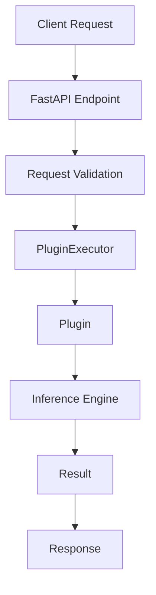

# Data and Inference Lifecycle

## Introduction

One of the goals of this platform is to keep inference workflows predictable and easy to extend.

Instead of allowing each plugin to implement its own execution mechanism, the platform provides a common execution path that handles validation, orchestration, logging, and error management in a consistent way.

This document describes how data moves through the system and how inference requests are processed from the moment an API call is received until a response is returned.

---

## A Typical Request Journey

At a high level, an inference request follows the path below:



Although the actual implementation contains multiple components, the overall idea is intentionally simple: requests enter through the API layer, are routed through the platform core, executed by plugins, and finally returned to the client.

---

## Step 1 — Receiving the Request

All execution starts at the API layer.

The platform exposes dedicated endpoints for plugin execution and model inference.

When a request reaches FastAPI, it is first processed by the middleware layer responsible for:

* Request tracking
* Error handling
* Performance measurement
* Structured logging

This ensures that operational concerns remain separated from business logic.

---

## Step 2 — Request Validation

Before execution begins, incoming payloads are validated using Pydantic models.

For inference workflows, requests are represented using:

```python
InferenceRequest
```

This creates a consistent contract between the API layer and the execution layer.

Validation happens before any plugin code is executed, reducing the likelihood of runtime failures caused by malformed input.

---

## Step 3 — Delegating Execution

Once the request has been validated, the API layer does not execute business logic directly.

Instead, execution is delegated to:

```python
PluginExecutor
```

The executor acts as a controlled runtime environment for plugins.

Its responsibilities include:

* Plugin instantiation
* Timeout enforcement
* Error isolation
* Execution monitoring
* Resource cleanup

This keeps API routes lightweight and focused on communication rather than processing.

---

## Step 4 — Plugin Resolution

The executor retrieves the requested plugin through:

```python
PluginRegistry
```

The registry maintains a catalog of available plugins discovered during application startup.

Because execution happens through the registry, the API layer does not need to know implementation details about individual plugins.

This makes it possible to add new geospatial capabilities without modifying the public API.

---

## Step 5 — Plugin Execution

Each plugin implements a common contract through:

```python
BasePlugin
```

and exposes its functionality through:

```python
run(payload)
```

At this stage, the plugin becomes responsible for interpreting the request and executing the required domain-specific logic.

Depending on the use case, the plugin may:

* Transform input data
* Invoke AI workflows
* Access registries
* Communicate with inference services
* Produce derived outputs

---

## Step 6 — Inference Processing

For model-based workflows, execution is routed through the platform's inference infrastructure.

The current implementation introduces a dedicated adapter plugin:

```python
model_adapter
```

which acts as a bridge between generic API requests and inference-specific execution logic.

The adapter constructs and forwards requests to:

```python
InferenceEngine
```

The inference engine provides a centralized location for model execution and future model management capabilities.

This design allows the platform to evolve without exposing model-specific implementation details to API consumers.

---

## Step 7 — Result Generation

After execution completes, the produced output is returned to the executor.

The executor wraps the result in a standardized response structure and ensures that any execution-related events have been recorded.

This includes:

* Success status
* Error information (if applicable)
* Execution metadata
* Logging events

---

## Step 8 — Response Delivery

Finally, the response is returned through FastAPI back to the client.

From the client's perspective, the entire process appears as a single API request.

Internally, however, the request has passed through several independent layers that separate validation, orchestration, execution, and inference responsibilities.

---

## Design Rationale

The lifecycle described above reflects one of the core architectural decisions of the project:

> Keep execution logic independent from the API layer.

Rather than embedding inference behavior directly inside routes, the platform relies on registries, executors, and plugins to coordinate execution.

This approach makes the system easier to maintain, easier to test, and significantly easier to extend as new GeoAI capabilities are introduced.

The current repository focuses on establishing this execution foundation first. Future machine learning and deep learning models can then be integrated through the existing plugin and inference infrastructure without requiring architectural redesign.
