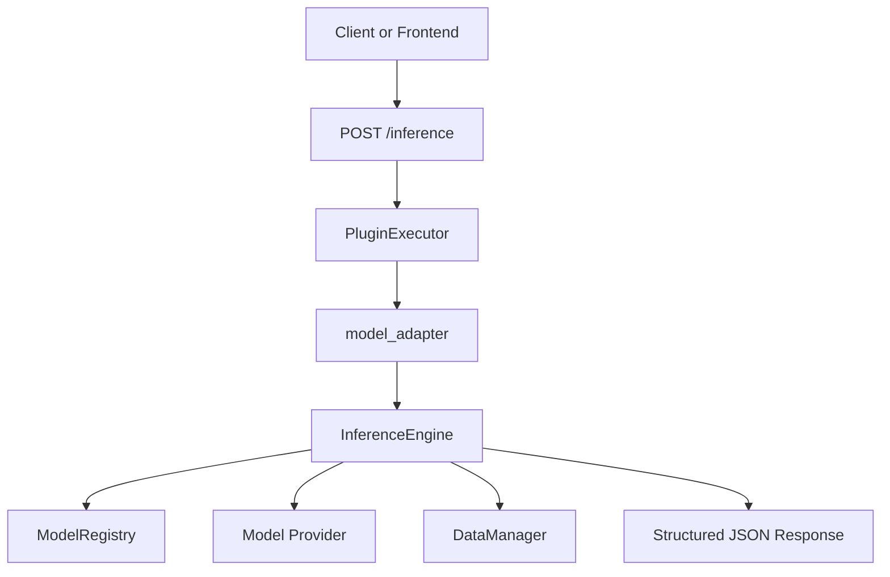

# Inference Lifecycle

## Purpose

This document explains how an inference request moves through GeoAI Platform once it reaches the model-execution path.

The main goal is to keep inference predictable.

A model request should not jump directly from an API endpoint into framework-specific code. Instead, it passes through a shared lifecycle that validates the request, resolves the model version, loads the model and input, runs prediction, and returns traceable execution details.

At the current stage, this flow is exercised through the `model_adapter` plugin and the lightweight `DummyModel`.

The same lifecycle is intended to support future trained GeoAI models without changing the public API or rebuilding the core execution path.

---

## Core principle

The inference layer is designed around one practical rule:

> A trained model should be treated as a versioned platform component, not as an isolated weights file.

That means the platform needs to know more than just how to call `predict()`.

It also needs a controlled way to answer questions such as:

- Which model was requested?
- Which version was actually used?
- Was the request valid?
- Where did the input come from?
- Which stage failed, if anything went wrong?
- How long did each step take?
- Which output belongs to which request?

The current implementation provides the foundation for that lifecycle.

---

## High-level inference path


```mermaid
flowchart TD
    Client[Client or Frontend]
    API[POST /inference]
    Executor[PluginExecutor]
    Adapter[model_adapter]
    Engine[InferenceEngine]
    Registry[ModelRegistry]
    Provider[Model Provider]
    Data[DataManager]
    Response[Structured JSON Response]

    Client --> API
    API --> Executor
    Executor --> Adapter
    Adapter --> Engine
    Engine --> Registry
    Engine --> Provider
    Engine --> Data
    Engine --> Response
```

The API does not load a model directly.

Instead, it sends the request through the shared plugin infrastructure. The `model_adapter` plugin then connects the request to the `InferenceEngine`, which owns the common inference lifecycle.

---

## Current request contract

Inference requests are represented by:

```python
InferenceRequest
```

The request contains the information needed to identify a model, select a version, provide input data, and attach optional execution parameters.

At a high level, the request can include:

```text
model_name
version strategy
input_payload or input_uri
parameters
request_id
tags
```

The model version can be resolved through a strategy such as:

```text
latest
```

or through an explicit version value.

The request can also carry a caller-provided `request_id`. When it is not provided, the inference engine creates a short trace identifier for the run.

---

## Lifecycle stages

The current `InferenceEngine` follows this sequence:

```text
validate
→ resolve_version
→ load_model
→ load_input
→ predict
→ build structured response
```

Each stage is timed and recorded as a trace event.

That makes the execution path easier to inspect during development and gives future production-oriented workflows a consistent basis for observability.

---

## 1. Request validation

The first step is:

```text
validate
```

Before model loading or prediction begins, the request validates its own input structure.

This protects the inference path from malformed or incomplete requests before they reach model-specific code.

The validation stage is intentionally early because failures are easier to understand when they are caught before any expensive work begins.

Examples of problems that should be detected at this point include:

```text
Missing model name
Invalid version configuration
Missing input source
Invalid input payload structure
Invalid parameters
```

A successful validation event is recorded before the request moves to model-version resolution.

---

## 2. Version resolution

The next stage is:

```text
resolve_version
```

The request may ask for the latest available version of a model or for a specific version.

The `InferenceEngine` asks the `ModelRegistry` to resolve that request into a concrete version.

This matters because model execution should be explicit and traceable.

For example, a future request may say:

```text
Use the latest version of padena_landslide_unet
```

but the response should still record the exact resolved version that was actually used.

That makes it possible to understand later which model produced a specific result.

When version resolution fails, the engine records the failed stage and returns a controlled execution error instead of continuing with an unclear model state.

---

## 3. Model loading

Once a version has been resolved, the engine enters:

```text
load_model
```

At this stage, the configured model provider retrieves the requested model implementation.

The engine does not need to know whether that future implementation will use:

```text
PyTorch
TensorFlow
Keras
ONNX
or another runtime
```

It only relies on the common model contract exposed through the provider.

In the current reproducible demo, the provider returns:

```text
DummyModel
```

The purpose of `DummyModel` is not scientific prediction. It simply verifies that the full platform path can load a model implementation and execute it through the same lifecycle that future models will use.

---

## 4. Input loading

The next stage is:

```text
load_input
```

The inference engine delegates input retrieval to:

```text
load_input_from_request(...)
```

This function converts request input into a standardised:

```python
ModelInput
```

The request can currently provide data in two ways:

```text
input_payload
```

or:

```text
input_uri
```

For the demo workflow, the input is supplied directly as a JSON payload.

The data manager abstraction keeps input access separate from model code.

That separation is important because a future model should not need to know whether data came from:

```text
A local JSON file
A GeoTIFF
A Cloud Optimized GeoTIFF
Object storage
A remote geospatial service
A user upload
```

The current implementation supports local JSON-oriented input. Future work can extend the same boundary toward raster and satellite-image workflows.

---

## 5. Prediction

After the model and input are ready, the engine runs:

```text
predict
```

The model receives the standardised input and returns its output.

The current engine supports an optional timeout value through the request parameters.

When a timeout is set, prediction runs inside a controlled thread-based execution boundary. If prediction exceeds the configured limit, the engine records the failure and raises an inference-timeout error.

This is intentionally modest infrastructure for the current local workflow.

It is not yet a distributed job system, GPU scheduler, or background-worker architecture. Those concerns belong to a later stage, once the platform begins running real models on larger geospatial inputs.

---

## 6. Trace events and timings

Each lifecycle stage records a trace event.

The current event structure includes:

```text
stage name
execution time in milliseconds
success or failure status
optional detail
```

Typical successful demo output includes stages such as:

```text
validate
resolve_version
load_model
load_input
predict
```

The engine also calculates total execution time.

This gives a request-level view of where time was spent and makes failures easier to localise.

For example:

```text
A version-resolution failure points toward model registration.
A load-input failure points toward data access or payload structure.
A timeout points toward prediction duration.
A prediction failure points toward model execution itself.
```

---

## 7. Structured response

When execution succeeds, the engine builds an:

```python
InferenceResponse
```

The response can include:

```text
request_id
trace_id
model_name
resolved version
output
timings_ms
events
tags
```

This response is returned through the API as structured JSON.

The purpose is not only to return a prediction.

It also gives the caller enough context to understand how that prediction was produced.

That becomes especially important when future workflows involve multiple model versions, different input datasets, or persisted results.

---

## Error handling

The inference engine keeps failures explicit.

The current lifecycle distinguishes between several broad failure types:

```text
Invalid request input
Version-resolution failure
Model-loading failure
Input-loading failure
Prediction failure
Inference timeout
```

When a stage fails, the engine records a failed trace event with timing and detail before raising a controlled error.

This prevents the API from returning a vague internal failure without context.

The goal is not to eliminate all possible errors. The goal is to make failures visible at the correct architectural layer.

---

## Relationship with `model_adapter`

The `InferenceEngine` does not act as a public API endpoint on its own.

The active public path uses:

```text
POST /inference
```

That request is routed through the plugin system.

The relevant plugin is:

```text
model_adapter
```

Its role is to bridge runtime model classes and the shared inference lifecycle.

The adapter prepares the model-related execution context and delegates the actual lifecycle to the engine.

This separation keeps responsibilities clear:

```text
API
→ receives and validates HTTP requests

Plugin infrastructure
→ resolves and executes plugins

model_adapter
→ connects model-related requests to inference

InferenceEngine
→ controls the common model-execution lifecycle

Model provider
→ returns the requested model implementation

Data manager
→ loads and standardises input
```

---

## Current reproducible demo

The reproducible demo runs the real inference path through the public API.

It performs these steps:

```text
1. Check backend health.
2. Confirm that model_adapter was discovered.
3. Load the version-controlled sample request.
4. Send the request to POST /inference.
5. Verify the returned status, plugin, and result.
6. Print trace information, timings, and prediction shape.
```

The relevant files are:

```text
demo/sample_inference_request.json
scripts/run_demo.py
```

The demo request uses a synthetic three-band raster-like payload.

It is not a Sentinel scene, a real GeoTIFF, or a landslide-validation dataset.

Its purpose is to prove that the platform route works end to end:

```text
API
→ Plugin Registry
→ model_adapter
→ InferenceEngine
→ JSON response
```

For the full runnable workflow, see:

- [Demo input package](../demo/README.md)
- [End-to-end demo pipeline](demo-pipeline.md)

---

## Current limitations

The current inference lifecycle is intentionally lightweight.

It does not yet include:

```text
Real trained model artifacts
GPU-backed execution
Raster or GeoTIFF input support
Satellite-image preprocessing
Large-scene tiling
Distributed workers
Queue-based execution
Retry policies
Model artifact storage
Result vectorisation
Production-scale monitoring
```

These are not hidden limitations.

They are future integration work that becomes relevant once a real GeoAI model is ready to be connected.

---

## Future direction

A future trained landslide model for the Padena area can follow the same overall lifecycle.

The workflow would eventually look like this:

```text
User selects an area or uploads data
→ frontend sends model and input request
→ data manager retrieves raster input
→ preprocessing creates standardised model input
→ model version is resolved
→ trained model is loaded
→ prediction produces a probability mask
→ post-processing prepares geospatial output
→ result is persisted
→ frontend visualises the result on the map
```

The most important requirement is consistency between model training and deployment.

A future model package should define a clear contract for:

```text
Input bands
Band order
Spatial resolution
Tile size
Normalisation method
Output format
Threshold policy
Model version
Evaluation metadata
```

The current architecture is intended to provide the system boundary around that future model contract.

It does not replace scientific model development. It gives the trained model a controlled and traceable place to run once it is ready.