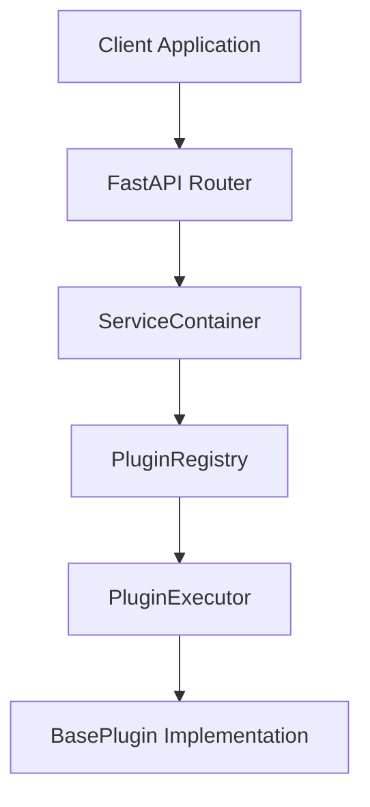
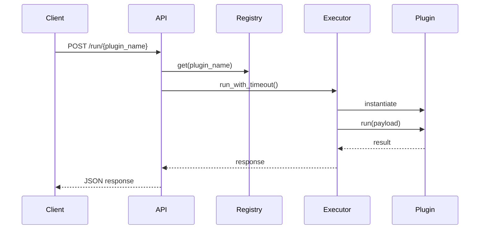
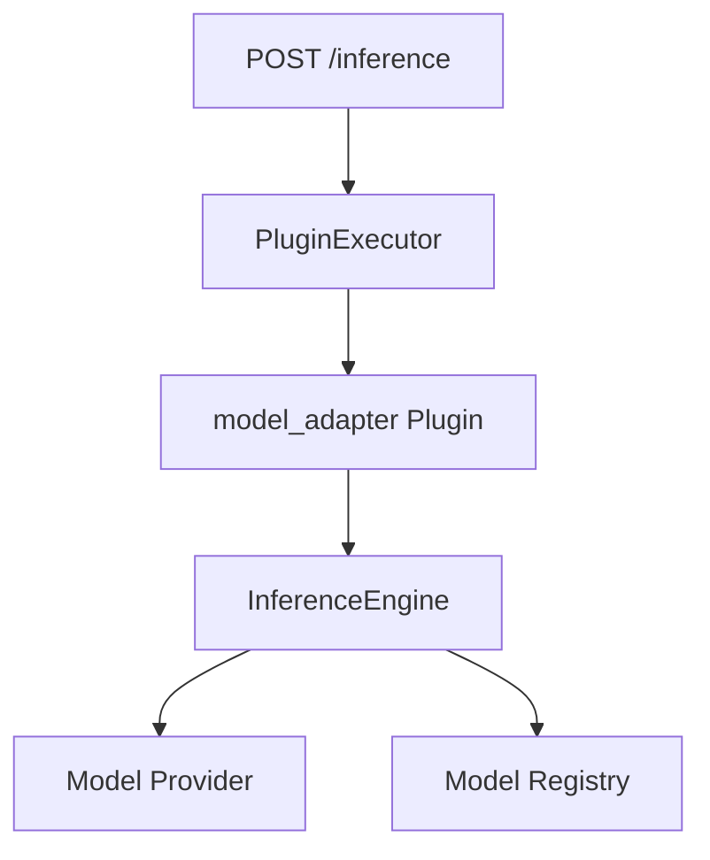

# Core, Plugin and API Flow

## Why a Plugin Architecture?

One of the main goals of this project was to avoid coupling the platform core to a single geospatial workflow.

In many GeoAI projects, the application logic, model execution, and domain-specific code become tightly connected over time. While this may work for a single research project, it becomes difficult to maintain once new use cases are introduced.

The architecture used here follows a different approach. The backend core is responsible for orchestration, while domain-specific capabilities are exposed through plugins.

This allows the platform to grow without continuously modifying the application core.

---

## High-Level Request Flow



---

## Application Startup

When the application starts, `create_app()` initializes the FastAPI application and creates a shared `ServiceContainer`.

The container acts as the central dependency holder for the platform and provides access to components such as:

* PluginRegistry
* ModelRegistry
* DataManager
* Logger
* Cache
* LLM Engine

The container instance is stored in:

```python
app.state.container
```

and becomes available to all API routes.

---

## Plugin Discovery

Plugins are not manually wired into the application.

The platform uses the `discover_plugins()` mechanism to scan the configured plugin package and automatically register valid plugin implementations.

Every plugin must inherit from:

```python
BasePlugin
```

and provide at least:

```python
name
version
run(payload)
```

This keeps the contract small and easy to extend.

---

## Plugin Registration

Discovered plugins are stored inside the in-memory `PluginRegistry`.

The registry is responsible for:

* Registering plugin classes
* Retrieving plugins by name
* Listing available plugins

This means the API layer never needs to know implementation details about individual plugins.

Instead, it only communicates with the registry.

---

## Runtime Execution Flow

The most generic execution path is exposed through:

```http
POST /run/{plugin_name}
```

The request flow is:



The API endpoint does not execute plugin logic directly.

Instead, execution is delegated to `PluginExecutor`, which is responsible for:

* Plugin instantiation
* Error isolation
* Timeout enforcement
* Logging
* Cleanup through `shutdown()`

This separation keeps routing logic simple and business logic independent.

---

## Unified Inference Flow

A second execution path exists for model inference.

Instead of exposing individual models directly through the API, the platform routes inference through a dedicated plugin called:

```text
model_adapter
```

The endpoint:

```http
POST /inference
```

builds a standardized `InferenceRequest` and forwards it to the plugin execution system.

Internally the flow becomes:



This design keeps the public API stable even if model implementations change later.

---

## Why This Design?

This architecture intentionally separates three different concerns:

### API Layer

Responsible for receiving and validating requests.

### Core Layer

Responsible for orchestration and dependency management.

### Plugin Layer

Responsible for domain-specific execution logic.

As a result, future capabilities such as landslide detection, flood analysis, wildfire monitoring, or custom AI pipelines can be added without redesigning the platform.

The current repository focuses on building this foundation first. The actual machine learning and deep learning models can later be integrated through the existing plugin and inference infrastructure.
