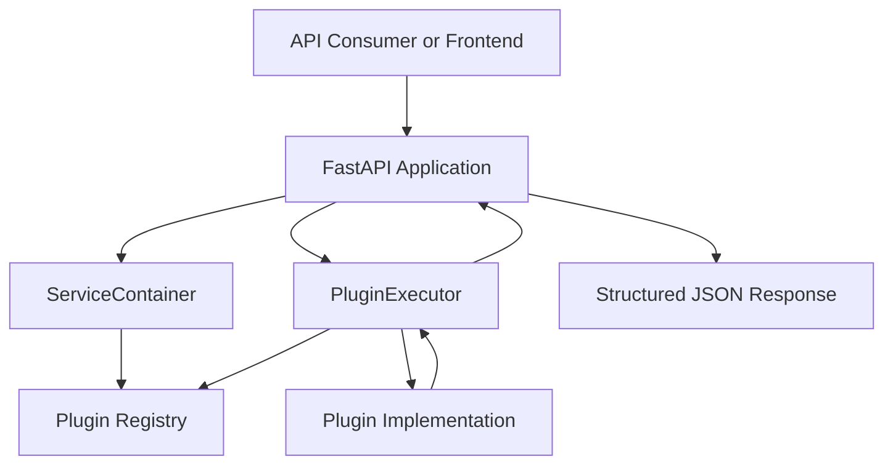
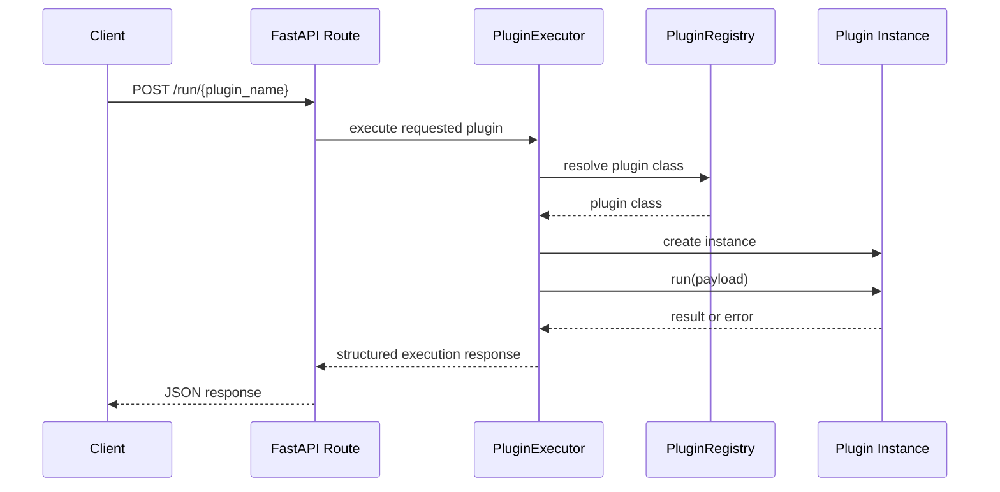
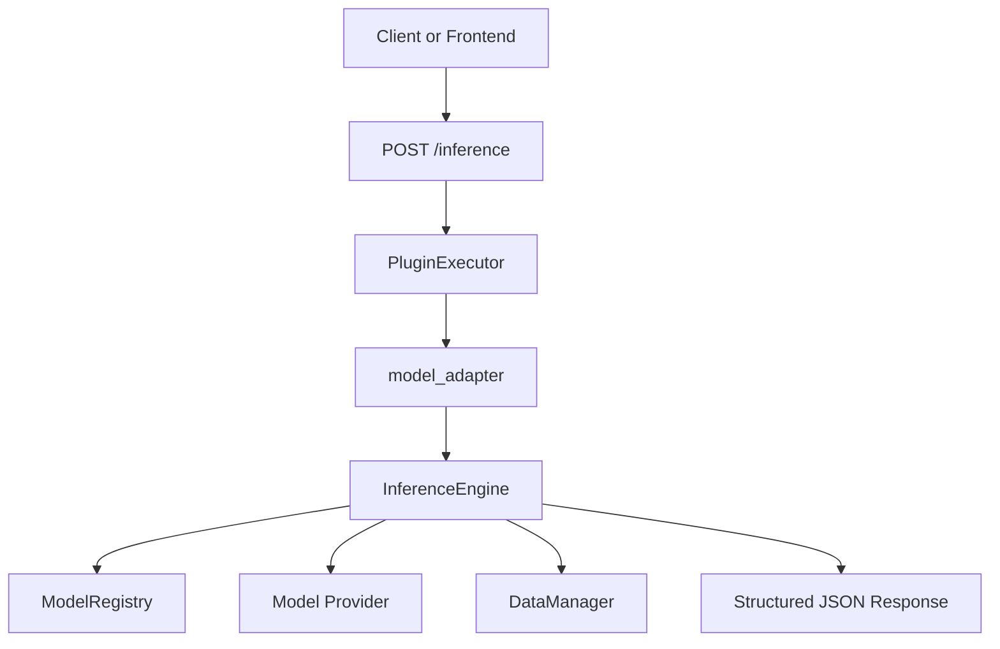

# Plugin Execution Flow

## Purpose

The plugin system is the part of GeoAI Platform that keeps domain-specific workflows separate from the shared platform infrastructure.

The backend should not need to be redesigned every time a new GeoAI capability is added. Instead, the platform provides a common way to discover, register, execute, and monitor plugins.

At the current stage, the active inference-related plugin is:

```text
model_adapter
```

It connects runtime-loadable model classes to the shared inference workflow.

Future plugins may support other workflows, such as landslide preprocessing, flood analysis, wildfire monitoring, post-processing, or geospatial data transformation.

The important point is that those future capabilities should be added as independent modules rather than embedded directly into the API layer.

---

## Core idea

The plugin architecture separates three responsibilities:

```text
API layer
→ receives HTTP requests and returns responses

Core execution layer
→ resolves plugins, controls execution, handles timeout and errors

Plugin layer
→ contains domain-facing workflow logic
```

This keeps the platform core stable while allowing the set of available GeoAI workflows to grow over time.

---

## High-level request flow


```mermaid
flowchart TD
    Client[API Consumer or Frontend]
    API[FastAPI Application]
    Container[ServiceContainer]
    Registry[Plugin Registry]
    Executor[PluginExecutor]
    Plugin[Plugin Implementation]
    Response[Structured JSON Response]

    Client --> API
    API --> Container
    Container --> Registry
    API --> Executor
    Executor --> Registry
    Executor --> Plugin
    Plugin --> Executor
    Executor --> API
    API --> Response
```

The API layer does not contain the implementation details of each plugin.

Instead, it delegates execution to the shared plugin infrastructure.

---

## Application startup

When the backend starts, the FastAPI application is created through:

```python
create_app()
```

During startup, the application creates a shared:

```text
ServiceContainer
```

The container acts as the central place where shared services are assembled and made available to the application.

Depending on the current configuration, the container provides access to components such as:

```text
PluginRegistry
PluginExecutor
ModelRegistry
DataManager
Persistence services
Configuration
Logging
Cache-related utilities
```

The container is attached to the FastAPI application through:

```python
app.state.container
```

This allows routes and internal services to access shared dependencies without creating them independently in multiple places.

---

## Plugin contract

Every plugin follows a shared base contract.

A plugin must provide enough information for the platform to identify and execute it in a consistent way.

The main required elements are:

```text
name
version
run(payload)
```

Plugins can also support a shutdown step when they need to release resources after execution.

The shared contract keeps the plugin interface intentionally small.

A plugin should focus on its own domain-specific responsibility. It should not need to reimplement common concerns such as plugin lookup, timeout handling, response wrapping, or centralised error handling.

---

## Plugin discovery

Plugins are discovered automatically during application startup.

The discovery process scans the configured plugin package and looks for valid plugin implementations.

A plugin is considered available only when it follows the shared plugin contract.

This removes the need to manually register every plugin inside route files or application startup code.

The practical benefit is that adding a new workflow does not require changing the API architecture.

A future plugin can be introduced by:

```text
1. Creating a new plugin package.
2. Implementing the shared plugin contract.
3. Making the plugin discoverable by the configured plugin package.
4. Restarting the application.
```

After discovery, the plugin becomes available through the registry.

---

## Plugin registry

Discovered plugins are stored in the in-memory:

```text
PluginRegistry
```

The registry is responsible for:

```text
Registering plugin classes
Retrieving a plugin by name
Listing available plugins
Preventing the API layer from depending on plugin implementation details
```

This means an endpoint does not need to import or instantiate a specific plugin directly.

Instead, it asks the registry for the plugin requested by the client.

The registry acts as the boundary between stable platform infrastructure and changing domain workflows.

---

## Generic plugin execution

The platform exposes a generic execution route:

```http
POST /run/{plugin_name}
```

This route is useful for plugins that follow the common execution contract.

The overall flow is:


```mermaid
sequenceDiagram
    participant Client
    participant API as FastAPI Route
    participant Executor as PluginExecutor
    participant Registry as PluginRegistry
    participant Plugin as Plugin Instance

    Client->>API: POST /run/{plugin_name}
    API->>Executor: execute requested plugin
    Executor->>Registry: resolve plugin class
    Registry-->>Executor: plugin class
    Executor->>Plugin: create instance
    Executor->>Plugin: run(payload)
    Plugin-->>Executor: result or error
    Executor-->>API: structured execution response
    API-->>Client: JSON response
```

The API route does not execute plugin logic directly.

It delegates the request to:

```text
PluginExecutor
```

The executor is responsible for common execution behaviour such as:

```text
Resolving the requested plugin
Creating a plugin instance
Applying timeout control
Handling execution errors centrally
Logging execution-related events
Calling cleanup logic when required
Returning a controlled response
```

This keeps API routes focused on HTTP responsibilities instead of business or workflow logic.

---

## Why execution is centralised

Without a shared executor, every plugin would gradually need its own implementation for timeout handling, error translation, logging, and cleanup.

That would make plugin behaviour inconsistent and harder to maintain.

The central executor provides a common path for plugin execution.

This gives the platform a predictable execution model even when the number of plugins grows.

It also makes future improvements easier. For example, a later version could add queue-based jobs, asynchronous workers, retry policies, or stronger observability without rewriting every plugin separately.

---

## Unified inference flow

Model inference uses the same plugin infrastructure, but it follows a more specialised path.

The public endpoint is:

```http
POST /inference
```

Instead of exposing individual model implementations directly through the API, the endpoint creates a standardised inference request and passes it through the plugin system.

The active plugin for this purpose is:

```text
model_adapter
```

The inference path is:


```mermaid
flowchart TD
    Client[Client or Frontend]
    API[POST /inference]
    Executor[PluginExecutor]
    Adapter[model_adapter]
    Engine[InferenceEngine]
    Registry[ModelRegistry]
    Provider[Model Provider]
    Data[DataManager]
    Response[Structured JSON Response]

    Client --> API
    API --> Executor
    Executor --> Adapter
    Adapter --> Engine
    Engine --> Registry
    Engine --> Provider
    Engine --> Data
    Engine --> Response
```

The purpose of this design is to keep the API independent from a concrete machine learning framework or model class.

The endpoint does not need to know whether a future model is based on:

```text
PyTorch
TensorFlow
Keras
ONNX
or another runtime
```

It only needs to send the request through the shared inference contract.

---

## Role of `model_adapter`

The current `model_adapter` plugin is the bridge between the plugin system and the inference engine.

Its responsibility is not to represent a particular trained model.

Instead, it receives a model-related request, resolves or prepares the runtime model provider, and delegates the actual execution lifecycle to:

```text
InferenceEngine
```

This makes it possible to add future model classes without changing the main API or plugin execution path.

The repository currently includes:

```text
DummyModel
```

`DummyModel` is intentionally lightweight.

It exists to validate that the complete platform path works:

```text
API
→ Plugin Registry
→ model_adapter
→ InferenceEngine
→ JSON response
```

It does not represent a trained landslide model, a scientific benchmark, or a real satellite-image inference workflow.

---

## Inference lifecycle inside the plugin flow

After `model_adapter` delegates to the inference engine, the shared inference lifecycle begins.

The current sequence is:

```text
validate request
→ resolve model version
→ load model
→ load input
→ run prediction
→ collect timings and execution events
→ return structured response
```

The result can include:

```text
Model name
Resolved model version
Request identifier
Trace identifier
Prediction output
Execution timings
Execution events
Request tags
```

More detail about this part of the system is available in:

- [Inference lifecycle](inference-lifecycle.md)
- [Architecture overview](architecture.md)

---

## Current demo path

The reproducible demo exercises the real plugin and inference path through the public API.

It performs the following checks:

```text
1. Verify that the backend is healthy.
2. Verify that model_adapter was discovered.
3. Send the version-controlled demo request.
4. Run the request through the real inference endpoint.
5. Print execution stages, timings, trace information, and output shape.
```

The demo request is stored in:

```text
demo/sample_inference_request.json
```

The demo runner is:

```text
scripts/run_demo.py
```

More detail is available in:

- [Demo input package](../demo/README.md)
- [End-to-end demo pipeline](demo-pipeline.md)

---

## Current limitations

The current plugin execution model is intentionally local and synchronous.

It is suitable for validating platform architecture, plugin discovery, controlled execution, and lightweight inference workflows.

It does not yet provide:

```text
Distributed workers
Background queues
Retry policies
Job prioritisation
GPU scheduling
Long-running task orchestration
Multi-tenant resource isolation
```

Those capabilities are not missing by accident. They belong to a later stage of the platform, once real models, larger geospatial inputs, and longer-running jobs are introduced.

The current architecture is designed so those concerns can be added around the execution layer later, without moving domain logic back into the API layer.

---

## Future direction

A future trained GeoAI model, such as a landslide-detection model for the Padena area, should be integrated as a model implementation that follows the platform contract.

The intended future path is:

```text
Trained model artifact
→ model metadata and version
→ model adapter
→ Model Registry
→ InferenceEngine
→ persisted result
→ frontend visualisation
```

New non-model workflows can also be added as independent plugins.

For example:

```text
Raster preprocessing plugin
Cloud-mask processing plugin
Flood analysis plugin
Wildfire analysis plugin
Result vectorisation plugin
Geospatial post-processing plugin
```

The key architectural rule remains the same:

> New GeoAI capabilities should extend the platform through clear plugin and model contracts, not by embedding domain logic directly into the API core.